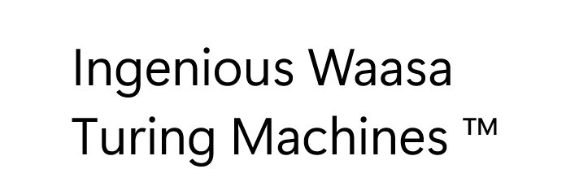

# SAST Assessment and Gathering Engine (SAGE)

SAGE is a simple JSON parser especially designed for **Static Application Security Testing** (SAST) report files.
It aims to make assessing your software security scans more comprehendable and efficient by providing a GUI to browse through your project's vulnerabilities.

## Installation

*No officially released version yet*

## Usage

SAGE does not scan your codebase for security issues itself. It is a tool that processes pre-generated SAST scan report files. It parses the vulnerabilities and their weaknesses from the report and loads them into an embedded
database for easier analysis.

An example sast report file can be found [here](gl-sast-report.json).

## Contributing

Found a bug, have a feature request or just want to help developing this project? Feel free to send me a direct message, and I'll open a ticket for it. Community
contributions are always highly appreciated!

To contribute:

1. Fork this repository.
2. Create a new branch for your feature or bug fix:
    ```bash
    git checkout -b feature/your-feature-name
    ```
3. Commit your changes with a descriptive message:
    ```bash
    git commit -m "Your message..."
    ```
4. Push to your fork:
    ```bash
    git push origin feature/your-feature-name
    ```
5. Open a pull request on the main repository.

### Guidelines

- Align your contributions with the project's goals and scope.
- Ensure your code adheres to Javas coding standards.
- This application aims to be as slim as possible without trying to reinvent the wheel. Thus, if you think the project could benefit from adding a new library open a new issue for it before just adding new dependencies.
 
## License

This project is licensed under the MIT License. See [LICENSE](LICENSE) file for details.

## Powered by
